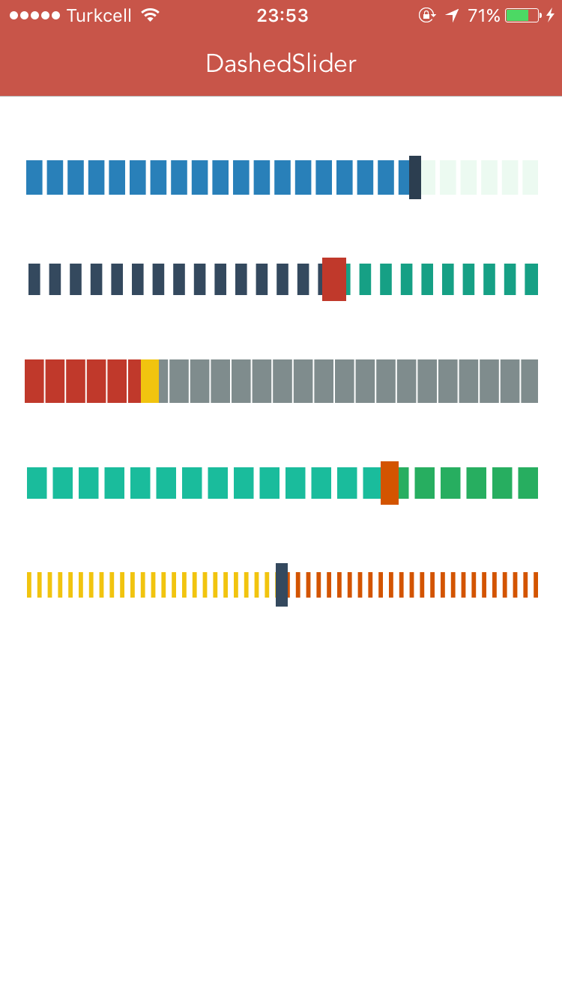

# DashedSlider

[](https://travis-ci.org/ayalcinkaya/DashedSlider)
[](http://cocoapods.org/pods/DashedSlider)
[](http://cocoapods.org/pods/DashedSlider)
[](http://cocoapods.org/pods/DashedSlider)


This library inspired by [JMMarkSlider](https://github.com/joamafer/JMMarkSlider)



## Usage

To run the example project, clone the repo, and run `pod install` from the Example directory first.

## Requirements

## Installation

DashedSlider is available through [CocoaPods](http://cocoapods.org). To install
it, simply add the following line to your Podfile:

```ruby
pod "DashedSlider"
```

## Author

ayalcinkaya
twitter [@ayalcinkaya_](https://twitter.com/ayalcinkaya_)

## License

DashedSlider is available under the MIT license. See the LICENSE file for more info.
